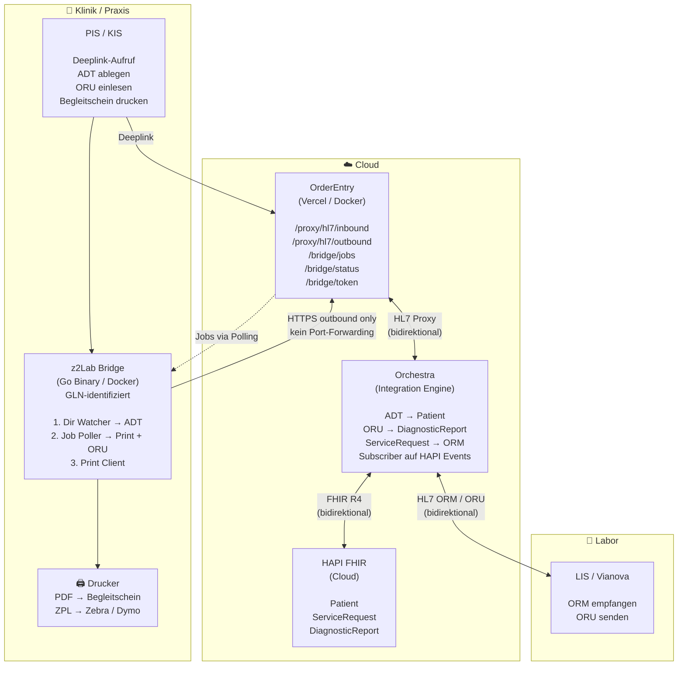
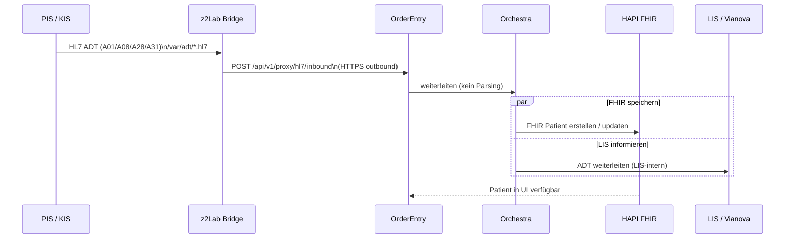
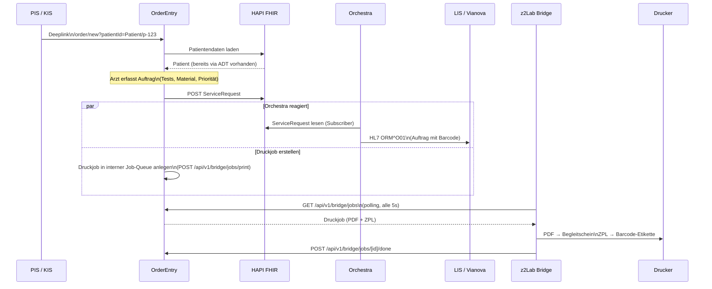
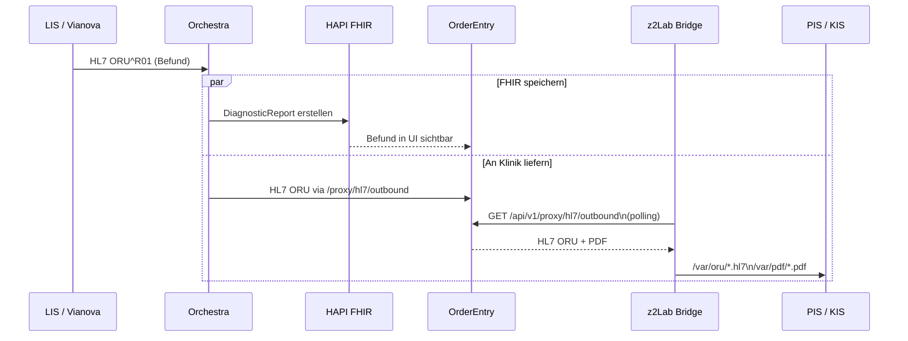

# z2Lab Bridge — Architektur & Entwicklungsstand

> **Naming (2026-04-26):** Das Produkt hieß früher „ZetLab Local Agent". Der Name wurde auf **z2Lab Bridge** geändert, um Verwechslungen mit Claude Code Sub-Agents (`.claude/agents/`) zu vermeiden. Spec, Code, DB-Schema, Routes und UI sind vollständig umgestellt — siehe `.claude/memory/bridge_naming.md` für die vollständige Refactor-Bilanz.

Die **z2Lab Bridge** ist die Brücke zwischen der Cloud-Infrastruktur (OrderEntry, Orchestra, HAPI FHIR) und den lokalen Systemen in Klinik, Praxis und Labor. Sie ermöglicht bidirektionalen HL7-Datenaustausch, lokalen Druck von Begleitscheinen und Barcode-Etiketten sowie die automatische Patientenübernahme aus bestehenden KIS/PIS-Systemen — ohne Firewall-Anpassungen oder Port-Forwarding.

---

## Inhaltsverzeichnis

1. [Architekturprinzipien](#architekturprinzipien)
2. [Komponenten](#komponenten)
3. [Gesamtübersicht](#gesamtübersicht)
4. [Datenflüsse](#datenflüsse)
5. [Implementierungsstand](#implementierungsstand)
6. [Offene Implementierungen](#offene-implementierungen)
7. [Implementierungsreihenfolge](#implementierungsreihenfolge)
8. [Deployment-Varianten](#deployment-varianten)
9. [Konfiguration](#konfiguration)
10. [Sicherheit & Auth](#sicherheit--auth)
11. [Resilienz & Betrieb](#resilienz--betrieb)

---

## Architekturprinzipien

| # | Prinzip | Begründung |
|---|---|---|
| 1 | **Cloud verarbeitet kein HL7** | OrderEntry ist reiner Proxy. HL7-Parsing und -Konvertierung liegt ausschliesslich bei Orchestra. |
| 2 | **Kommunikation ist outbound-only** | Die Bridge baut Verbindungen zur Cloud auf — nie umgekehrt. Kein Port-Forwarding, keine Firewall-Anpassungen. |
| 3 | **Orchestra ist der einzige HL7↔FHIR-Konverter** | ADT→Patient, ORU→DiagnosticReport, ServiceRequest→ORM erfolgen ausschliesslich in Orchestra. |
| 4 | **Alle lokalen Integrationen laufen über die Bridge** | Kein lokales System kommuniziert direkt mit der Cloud. Die Bridge ist der einzige Zugangspunkt. |
| 5 | **Routing über Organization GLN** | Jede Bridge ist über ihren API-Key eindeutig einer FHIR-Organization (GS1-GLN) zugeordnet. Druckjobs und ORU-Dateien werden klinikspezifisch zugestellt. |
| 6 | **Polling statt Push** | Die Bridge pollt aktiv für ausstehende Jobs. Die Cloud muss keine Verbindungen initiieren. |

---

## Komponenten

### Cloud

| Komponente | Aufgabe |
|---|---|
| **OrderEntry** (Vercel/Docker) | Web-UI für Auftragserfassung; HL7-Proxy (kein Parsing); Bridge-API (`/bridge/jobs`, `/bridge/status`) |
| **Orchestra** (Integration Engine) | Bidirektionaler HL7↔FHIR-Konverter; Subscriber auf HAPI FHIR Events; Verbindung zum LIS |
| **HAPI FHIR** | FHIR R4 Datenspeicher für Patient, ServiceRequest, DiagnosticReport |

### Lokal — Klinik / Praxis

| Komponente | Aufgabe |
|---|---|
| **z2Lab Bridge** (Go Binary / Docker) | Directory Watcher für ADT; Job Poller für Druckjobs + ORU; Print Client (PDF + ZPL) |
| **PIS / KIS** | Patientenverwaltungssystem; legt ADT-Dateien ab; ruft OrderEntry-Deeplink auf; liest ORU ein |
| **Drucker** | Begleitschein-Drucker (PDF/CUPS/WinPrint); Barcode-Drucker (ZPL/Zebra/Dymo) |

### Lokal — Labor

| Komponente | Aufgabe |
|---|---|
| **LIS / Vianova** | Laborinformationssystem; empfängt HL7 ORM (Aufträge); sendet HL7 ORU (Befunde) |

---

## Gesamtübersicht



---

## Datenflüsse

### Szenario 1 — ADT: Patient aus KIS/PIS in OrderEntry

Ein Patient wird im PIS/KIS aufgenommen. Die Bridge erkennt die neue ADT-Datei und überträgt sie in die Cloud. Orchestra konvertiert die HL7-Nachricht in eine FHIR-Patient-Ressource und schreibt sie in HAPI FHIR. Parallel leitet Orchestra die ADT-Nachricht auch ans LIS weiter. Der Patient erscheint sofort in der OrderEntry-Oberfläche.



---

### Szenario 2 — Auftragserfassung: Deeplink → ServiceRequest → LIS → Druck

Das PIS/KIS öffnet OrderEntry per Deeplink mit dem Patienten-Kontext. Der Arzt erfasst den Laborauftrag. OrderEntry persistiert den ServiceRequest in HAPI FHIR. Orchestra empfängt den neuen ServiceRequest als Subscriber, erstellt daraus eine HL7 ORM-Nachricht und sendet sie ans LIS. Gleichzeitig erstellt OrderEntry einen Druckjob, den die Bridge per Polling abholt und lokal ausdruckt.



> **GLN-Routing:** Jede Bridge authentifiziert sich mit einem klinikspezifischen API-Key (`Bearer`-Token). OrderEntry liest daraus die FHIR-Organization-ID (GS1-GLN) und stellt Druckjobs ausschliesslich der zuständigen Bridge zu.

---

### Szenario 3 — ORU: Laborbefund zurück an Klinik

Das LIS meldet einen fertigen Laborbefund als HL7 ORU^R01 an Orchestra. Orchestra verarbeitet die Nachricht auf zwei parallelen Wegen: Es konvertiert die ORU in einen FHIR DiagnosticReport (sichtbar in OrderEntry-UI) und leitet die ORU gleichzeitig als Datei über den Bridge-Proxy an die Klinik zurück.



> **Paralleler Fluss:** HAPI FHIR und die lokale ORU-Zustellung sind voneinander unabhängig. Beide Wege laufen gleichzeitig.

---

## Implementierungsstand

### ✅ Bereits in OrderEntry gebaut

#### Bridge API

| Route | Methode | Funktion |
|---|---|---|
| `/api/v1/bridge/status` | GET | Connectivity-Check, Token-Validierung, HL7-Proxy-Status |
| `/api/v1/bridge/token` | POST | JWT / PAT für Bridge-Authentifizierung ausstellen |

#### HL7 Proxy

| Route | Methode | Funktion |
|---|---|---|
| `/api/v1/proxy/hl7/inbound` | POST | HL7 von der Bridge → Orchestra (ADT, ORU) |
| `/api/v1/proxy/hl7/outbound` | GET | HL7 von Orchestra → Bridge (ORU, Polling) |

#### FHIR Proxy

| Route | Methode | Funktion |
|---|---|---|
| `/api/v1/proxy/fhir/patients` | GET | Patientenliste |
| `/api/v1/proxy/fhir/patients/[id]` | GET | Einzelpatient |
| `/api/v1/proxy/fhir/patients/[id]/service-requests` | GET | Aufträge je Patient |
| `/api/v1/proxy/fhir/patients/[id]/diagnostic-reports` | GET | Befunde je Patient |
| `/api/v1/proxy/fhir/service-requests` | GET | Alle Aufträge |
| `/api/v1/proxy/fhir/service-requests/[id]` | GET | Einzelauftrag |
| `/api/v1/proxy/fhir/diagnostic-reports` | GET | Alle Befunde |

#### Auth (für Bridge nutzbar)

| Route | Methode | Funktion |
|---|---|---|
| `/api/v1/auth/token` | POST | JWT / PAT ausstellen (Bearer Auth) |
| `/api/v1/users/[id]/token` | POST | PAT pro User / Klinik |

#### Begleitschein & Druck (Browser-seitig)

Bereits vollständig implementiert in `src/presentation/hooks/useOrderDocuments.ts`:

- `buildBegleitscheinHtml()` — vollständiges HTML mit Patientendaten, Proben-Tabelle, Barcodes
- `printBegleitschein()` — öffnet Browser-Druckdialog
- `printLabel()` — Barcode-Etikette im Browser drucken
- `buildBegleitscheinBase64()` — Base64-PDF für HL7 OBX-Segment + FHIR DocumentReference
- Auto-Print nach Auftragserfassung (`OrderCreatePage.tsx`)
- Barcodes: CODE128 via JsBarcode — Format `{orderNumber} {materialCode}`

> **Hinweis:** Der Browser-Druck ist fertig. Der Bridge-seitige Druck (für Kliniken ohne Browser-Zugang, Zebra-Drucker) ist noch nicht implementiert.

---

## Offene Implementierungen

### Phase 1 — OrderEntry Server-side

#### 1. Print Job Queue

```
POST /api/v1/bridge/jobs/print       ← Druckjob nach Auftragserfassung erstellen
GET  /api/v1/bridge/jobs             ← Bridge pollt: offene Print- + ORU-Jobs
POST /api/v1/bridge/jobs/[id]/done   ← Bridge bestätigt Job abgeschlossen
```

#### 2. ZPL-Generierung (Server-side)

- Barcode-Etikette als ZPL-Template für Zebra/Dymo-Drucker
- Format: `{orderNumber} {materialCode}` (LIS-Barcode-Konvention)

#### 3. Bridge Registration & Management

```
POST   /api/v1/bridge/register       ← Klinik registriert Bridge → erhält API-Key
GET    /api/v1/bridge/list           ← Admin: alle registrierten Bridges
DELETE /api/v1/bridge/[id]           ← Admin: Bridge deaktivieren
```

#### 4. Admin UI — Bridge-Verwaltung (`/admin/bridges`)

- Übersicht registrierter Kliniken: letzter Kontakt, Bridge-Version, Status
- Aktionen: API-Key erstellen, deaktivieren, erneuern

#### 5. Druckjob-Routing — Practitioner → Abteilung → Bridge ⚠️ TODO: Design-Entscheidung offen

Beim Erstellen eines Auftrags ist ein **Practitioner** (mit GLN) bereits ausgewählt.
Dieser Practitioner gehört via `PractitionerRole` zu einer **Location / Abteilung**.
Jede Abteilung hat eine eigene registrierte **Bridge** mit eigenem Drucker.

**Offene Frage:** Wie wird die Zuordnung `Practitioner → Abteilung → Bridge` gespeichert?

**Kandidat:** `PractitionerRole.location` in HAPI FHIR — der Practitioner ist einer Location
zugeordnet, die Bridge ist für diese Location registriert. OrderEntry liest beim
Auftragserstellen die PractitionerRole und routet den Druckjob an die zuständige Bridge.

**Zwei Routing-Modi:**
- **Broadcast** — Druckjob geht an alle Bridges der Organization (Fallback)
- **Gezielt** — Druckjob geht an die Bridge der Abteilung des erstellenden Practitioners

**Muss geklärt werden:**
- [ ] Wird `PractitionerRole.location` als Routing-Grundlage verwendet?
- [ ] Wie wird eine Bridge einer Location zugeordnet? (bei Registrierung / Admin UI)
- [ ] Was passiert wenn keine Bridge für die Location registriert ist → Broadcast oder Fehler?

---

### Phase 2 — Orchestra Konfiguration

#### 5. ADT-Szenario

Orchestra benötigt ein Szenario für eingehende ADT-Nachrichten:

- `A01` — Patient aufnehmen
- `A08` — Patientendaten ändern
- `A28` / `A31` — Patient anlegen / updaten

Aktuell ist nur das ORM-Szenario (Auftragserfassung → LIS) vorhanden.

---

### Phase 3 — Bridge (separates Go-Projekt)

```
z2lab-bridge/
├── main.go                  # Entry point, Service-Registrierung (Windows/macOS/Linux/Docker)
├── watcher/
│   └── adtWatcher.go        # Directory Watcher → POST /proxy/hl7/inbound
├── poller/
│   └── jobPoller.go         # GET /bridge/jobs → Drucken + ORU schreiben
├── printer/
│   ├── pdfPrinter.go        # PDF → CUPS (Linux/macOS) / WinPrint (Windows)
│   └── zplPrinter.go        # ZPL → TCP:9100 (Zebra / Dymo RAW)
├── writer/
│   └── oruWriter.go         # HL7 ORU → lokales Verzeichnis
├── config/
│   └── config.go            # ENV-Konfiguration
└── Dockerfile
```

**Technologie:** Go — cross-platform, single binary, kein Runtime erforderlich.

---

### ⚠️ Offene Entscheidung — Go Framework-Wahl

Bevor die Bridge implementiert wird, muss das Go-Framework geklärt werden.

#### Optionen

| Framework | Typ | Vorteile | Nachteile |
|---|---|---|---|
| **Standard Library** | Pure Go | Kein Overhead, maximale Kontrolle, keine Abhängigkeiten | Mehr Boilerplate |
| **Cobra** | CLI Framework | Strukturierte Commands, Flags, Help-Texte | Nur für CLI — kein HTTP |
| **Fiber** | HTTP Framework | Sehr schnell, Express-ähnlich | Overkill wenn kein Web-UI |
| **Chi** | HTTP Router | Leichtgewichtig, Standard-kompatibel | Nur Routing |
| **Gin** | HTTP Framework | Beliebt, viel Community | Grösser als Chi |

#### Empfehlung zur Diskussion

```
Für die Bridge:
  HTTP Client  → Standard Library (net/http) — reicht für Polling
  CLI / Flags  → Cobra — für Konfiguration und Service-Commands
  Filesystem   → fsnotify — Directory Watcher
  Druck (ZPL)  → Standard Library (net.Dial TCP)
  Druck (PDF)  → go-cups oder os/exec (lp / lpr)
  SQLite       → modernc.org/sqlite (kein CGO nötig)
```

**Kein HTTP-Server-Framework nötig** — die Bridge ist ein Client, kein Server.
Nur der Health-Endpoint (`localhost:7890/health`) braucht einen minimalen HTTP-Server
→ Standard Library reicht.

#### Entscheidung — Zielplattformen

✅ **Windows, Linux, macOS, Docker** — alle vier müssen unterstützt werden.

Go kompiliert für alle Plattformen aus einer einzigen Codebase:

```bash
GOOS=windows GOARCH=amd64  go build → z2lab-bridge.exe          (Klinik Windows PC)
GOOS=linux   GOARCH=amd64  go build → z2lab-bridge-linux        (Server / NUC)
GOOS=linux   GOARCH=arm64  go build → z2lab-bridge-linux-arm64  (Raspberry Pi / ARM)
GOOS=darwin  GOARCH=amd64  go build → z2lab-bridge-mac-intel    (Mac Intel)
GOOS=darwin  GOARCH=arm64  go build → z2lab-bridge-mac-m1       (Mac Apple Silicon)
```

#### Gewählte Packages

| Package | Zweck | Begründung |
|---|---|---|
| `cobra` | CLI Commands | start / stop / status / register |
| `fsnotify` | Directory Watcher | Cross-platform, alle 4 Plattformen |
| `golang.org/x/sys` | Windows Service | `windows/svc` für Service-Registrierung |
| `modernc.org/sqlite` | Lokale DB | Kein CGO — funktioniert auf allen Plattformen |
| `log/slog` | Logging | Go 1.21 Standard — kein extra Package nötig |

#### Plattform-spezifisches Verhalten

| Funktion | Windows | Linux | macOS | Docker |
|---|---|---|---|---|
| **Service** | Windows Service (`svc`) | systemd Unit | LaunchAgent plist | Container |
| **PDF Druck** | WinPrint API | CUPS (`lp`) | CUPS (`lp`) | Via Host-Drucker |
| **ZPL Druck** | TCP:9100 | TCP:9100 | TCP:9100 | TCP:9100 |
| **Installer** | `.msi` (geplant) | `.deb`/`.rpm` (geplant) | `.pkg` (geplant) | `docker pull` |

#### Entscheidungen

**Config:** Option C — YAML + ENV Override
```
Priorität: ENV Variable > config.yaml > Default
```
```yaml
# config.yaml (für Windows/Mac Benutzer ohne ENV-Kenntnisse)
orderentry_url: https://orderentry.zlz.ch
api_key: abc123
poll_interval_ms: 5000
adt_watch_dir: C:\adt\
printer_name: HP_LaserJet
zebra_ip: 192.168.1.100
```
```bash
# ENV Override (für Docker / Linux)
BRIDGE_ORDERENTRY_URL=https://orderentry.zlz.ch
BRIDGE_API_KEY=abc123
```

**Auto-Update:** Option B — Bridge prüft selbst
```
Beim Status-Poll → Server meldet aktuelle Version
    ↓
Bridge vergleicht mit eigener Version
    ↓
Neue Version verfügbar?
    → Binary herunterladen (GitHub Releases)
    → Checksumme prüfen (SHA-256)
    → Altes Binary ersetzen
    → Service neu starten
```

**Installer:** Option B — Gleichzeitig mit OrderEntry Go-Live

```
Go-Live Milestone:
  ✅ OrderEntry (Next.js)     → produktiv
  ✅ z2Lab Bridge             → produktiv
  ✅ Installer für alle Plattformen bereit:
       Windows  → z2lab-bridge-setup.exe (.msi)
       macOS    → z2lab-bridge.pkg
       Linux    → z2lab-bridge.deb / .rpm
       Docker   → docker pull z2lab/bridge
```

Das bedeutet: **Bridge-Entwicklung muss parallel zu OrderEntry laufen.**

---

### Phase 4 — Admin UI

#### 4. `/admin/bridges`

Verwaltungsseite für registrierte Bridges: Status, Version, letzter Kontakt, Key-Management.

---

## Deployment-Varianten

### Modell 1 — Cloud-Only *(ohne Bridge — für einfache Integrationen)*

Keine lokale Bridge. Alle Dienste laufen in der Cloud.

| Funktion | Lösung |
|---|---|
| **Druck** | Cloud Printing / Remote Printing — Drucker ist direkt über das Internet oder VPN erreichbar |
| **ORU-Zustellung** | SFTP — Orchestra legt ORU-Dateien auf einem SFTP-Server ab; PIS/KIS holt sie von dort ab |
| **ADT** | Direkter FHIR-Push vom KIS/PIS in die Cloud (keine Bridge-Watcher nötig) |

**Einsatz:** Kliniken mit einfacher IT-Infrastruktur, Cloud-Druckern oder bestehendem SFTP-Workflow.

**Einschränkungen:** Kein lokaler Offline-Puffer, kein automatischer Druckjob-Routing über Abteilungen, SFTP-Konfiguration auf KIS-Seite erforderlich.

---

### Modell 2 — Bridge Standard *(empfohlen für Praxen und kleine Kliniken)*

Gesamte Infrastruktur (OrderEntry, Orchestra, HAPI FHIR) läuft in der Cloud. Lokal wird ausschliesslich die Bridge betrieben.

| Betriebssystem | Deployment |
|---|---|
| Windows | `z2lab-bridge.exe` als Windows Service |
| macOS | `z2lab-bridge` als LaunchAgent |
| Linux | `z2lab-bridge` als systemd Service |
| Docker | `docker run z2lab/bridge` |

### Modell 3 — Hybrid *(für grosse Kliniken mit erhöhten Datenschutzanforderungen)*

OrderEntry und Orchestra laufen in der Cloud. HAPI FHIR und die Bridge laufen lokal — Patientendaten verlassen das Haus nicht. Die Verbindung zur Cloud erfolgt über einen ausgehenden Cloudflare Tunnel (kein Port-Forwarding).

```
Cloud:  OrderEntry UI + Orchestra
Lokal:  HAPI FHIR + z2Lab Bridge
        Verbindung: Cloudflare Tunnel (outbound)
```

---

## Konfiguration

### Bridge ENV-Variablen

| Variable | Standard | Beschreibung |
|---|---|---|
| `BRIDGE_ORDERENTRY_URL` | — | OrderEntry Cloud URL (erforderlich) |
| `BRIDGE_API_KEY` | — | Klinikspezifischer API-Key / PAT (erforderlich) |
| `BRIDGE_POLL_INTERVAL_MS` | `5000` | Polling-Intervall in Millisekunden |
| `BRIDGE_ADT_WATCH_DIR` | `/var/adt/` | Verzeichnis für eingehende ADT HL7-Dateien |
| `BRIDGE_ORU_OUTPUT_DIR` | `/var/oru/` | Verzeichnis für ausgehende ORU HL7-Dateien |
| `BRIDGE_PDF_OUTPUT_DIR` | `/var/pdf/` | Verzeichnis für ausgehende PDF-Dateien |
| `BRIDGE_PRINTER_NAME` | — | Druckername für Begleitschein (CUPS / WinPrint) |
| `BRIDGE_ZEBRA_IP` | — | IP-Adresse des Zebra/Dymo-Druckers (optional) |
| `BRIDGE_ZEBRA_PORT` | `9100` | TCP-Port für ZPL RAW-Druck |
| `BRIDGE_HEALTH_PORT` | `7890` | Lokaler Health-Endpoint-Port (0 = deaktiviert) |
| `BRIDGE_JOB_TIMEOUT_MS` | `30000` | Maximale Laufzeit pro Job |
| `BRIDGE_RETRY_MAX_HOURS` | `24` | Maximale Retry-Dauer für fehlgeschlagene ADT-Uploads |
| `BRIDGE_LOG_FILE` | `/var/log/z2lab-bridge.log` | Pfad zur Audit-Log-Datei |
| `BRIDGE_LOG_RETENTION_DAYS` | `30` | Aufbewahrungsdauer für Log-Einträge |

---

## Sicherheit & Auth

### Konzept

Jede Klinik erhält bei der Registrierung einen eigenen API-Key (Personal Access Token). Die Bridge sendet diesen Key bei jedem Request als `Authorization: Bearer`-Header. OrderEntry identifiziert darüber die Klinik und deren FHIR-Organization (inkl. GS1-GLN). Ein Key kann jederzeit widerrufen werden, ohne andere Kliniken zu beeinflussen.

### Request-Header der Bridge

```
Authorization:    Bearer <BRIDGE_API_KEY>
X-Clinic-ID:      org-123          (FHIR Organization ID)
X-Bridge-Version: 1.2.0
```

`X-Clinic-ID` ermöglicht klinikspezifisches Logging und Routing von Druckjobs / ORU-Dateien.

---

## Resilienz & Betrieb

### Offline-Puffer

Bei Cloud-Nichterreichbarkeit puffert die Bridge ADT-Dateien lokal:

```
/var/adt/pending/   ← neue Dateien vom PIS
/var/adt/sent/      ← erfolgreich übertragen (Audit-Aufbewahrung)
/var/adt/failed/    ← nach maximaler Retry-Dauer → manuelle Prüfung
```

Retry-Strategie: exponentielles Backoff (5 s → 30 s → 5 min). Nach Wiederherstellung der Verbindung wird die Pending-Queue automatisch abgearbeitet.

### Datei-Deduplizierung

Jede gesendete Datei wird per SHA-256-Hash in einer lokalen SQLite-Datenbank (`/var/adt/sent.db`) markiert. Vor jedem Upload prüft die Bridge, ob der Hash bereits bekannt ist — bekannte Dateien werden übersprungen.

### Health Endpoint

```
GET http://localhost:7890/health   → { "status": "ok", "version": "1.2.0", "lastPoll": "..." }
GET http://localhost:7890/metrics  → Prometheus text (optional)
```

Nur lokal erreichbar (`127.0.0.1`). Ermöglicht Docker `HEALTHCHECK` und Service-Monitor.

### Startup-Validierung

Beim Start prüft die Bridge alle Voraussetzungen, bevor sie in den Polling-Loop eintritt:

```
[ ] BRIDGE_ORDERENTRY_URL erreichbar (HTTP 200 / 401)
[ ] API-Key gültig (GET /api/v1/bridge/status → 200)
[ ] ADT_WATCH_DIR existiert und ist lesbar
[ ] ORU_OUTPUT_DIR existiert und ist schreibbar
[ ] PDF_OUTPUT_DIR existiert und ist schreibbar
[ ] Drucker erreichbar (CUPS-Abfrage oder TCP-Ping auf Zebra-IP)
```

Kritische Fehler beenden die Bridge mit Exit-Code 1. Nicht-kritische Fehler (z. B. Drucker fehlt) werden geloggt; die Bridge startet trotzdem.

### Graceful Shutdown

Die Bridge fängt `SIGTERM` / `SIGINT` ab, schliesst den laufenden Job ab, sichert offene ADT-Dateien in die Pending-Queue und beendet sich sauber mit Exit-Code 0.

### Auto-Update

Beim Status-Poll vergleicht die Bridge ihre Version mit der vom Server gemeldeten Mindestversion. Liegt die eigene Version darunter, wird eine kritische Warnung geloggt und eine Admin-Benachrichtigung ausgelöst.

### Audit Log

```
2026-04-04T14:32:01Z  ADT  SENT     patient_123.hl7  sha256:abc123
2026-04-04T14:32:06Z  ORU  WRITTEN  oru_456.hl7      → /var/oru/
2026-04-04T14:32:07Z  PDF  PRINTED  job_789.pdf      → HP_LaserJet
2026-04-04T14:35:00Z  ADT  RETRY    patient_124.hl7  attempt=2
```

Format: strukturiertes JSON oder TSV. Rotation täglich, Aufbewahrung 30 Tage (nDSG-konform).

---

## Referenzen

| Quelle | Inhalt |
|---|---|
| `CLAUDE.md` → Orchestra Integration | JWT-Vertrag, Launch-Flow, HL7-Proxy-Regeln |
| `src/app/api/v1/proxy/hl7/` | HL7 Proxy Routes (implementiert) |
| `src/app/api/v1/bridge/` | Bridge Routes — vollständig implementiert |
| `src/presentation/hooks/useOrderDocuments.ts` | Begleitschein + Barcode (Browser-seitig, fertig) |
